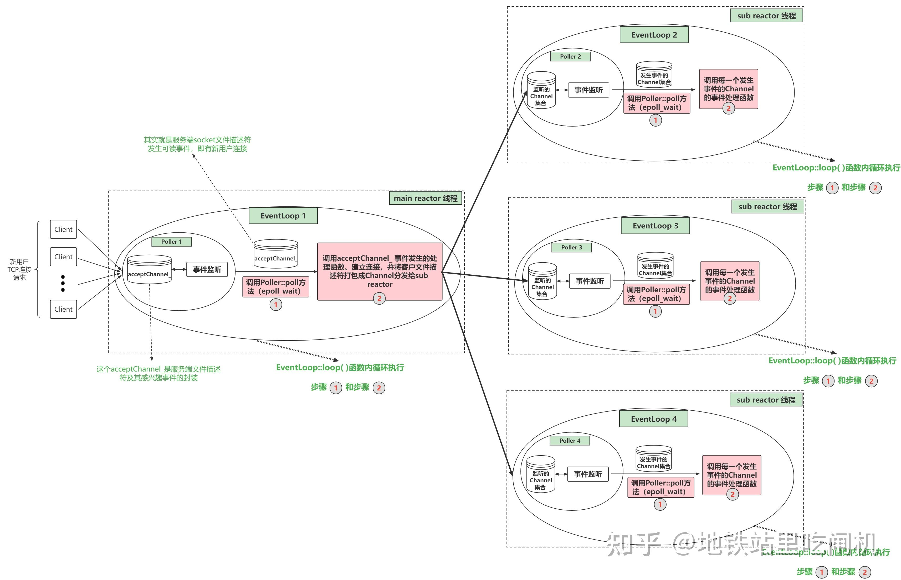

**Reactor 模型** 是一种常用于高并发事件驱动的编程模型，尤其在网络编程中被广泛应用。它的核心思想是通过事件循环和事件分发机制，将不同的事件（如 I/O 操作、用户输入等）与处理这些事件的回调函数或处理器解耦，从而能够高效地处理大量并发请求。

Reactor 模型通常包含以下几个核心组件：

1. **事件源（Event Source）**： 事件源是程序可能触发事件的对象。例如，在网络服务器中，事件源可能是一个新的网络连接、客户端的请求、I/O 操作的完成等。
2. **事件分发器（Reactor）**： Reactor 是事件循环的核心组件，它负责监听来自多个事件源的事件，并将事件分发到相应的事件处理器。Reactor 通过 I/O 多路复用（如 `select`、`poll`、`epoll` 等）来监听多个事件源，并在事件发生时分发事件。
3. **事件处理器（Handlers）**： 事件处理器是实际处理某个事件的对象。每个事件源都有一个与之关联的事件处理器，当某个事件发生时，Reactor 会将事件分发到相应的事件处理器中执行。事件处理器通常是回调函数或方法，它定义了如何处理特定的事件。
4. **I/O 多路复用（I/O Multiplexing）**： I/O 多路复用技术允许单个线程或进程同时监听多个 I/O 操作，如网络连接或文件读写，而不需要为每个操作创建一个单独的线程或进程。常见的 I/O 多路复用技术有 `select`、`poll`、`epoll`（Linux）、`kqueue`（Mac OS）等。

基于C++20开发的适用于Linux的事件驱动型多线程网络库，附带有日志、定时器、线程池模块，

noncopyable
Logger.hpp
inetaddress.hpp

callback.hpp

timer.hpp

channel.hpp   channel.cc{eventloop*}

timerqueue  含有自己的timerfd                         

eventloop {其中含有epollpooler  含有timerqueue     含有wakeupfd}

acceptor

countdownlatch   eventloopThread

buffer

tcpconnection  tcpsingleserver 

tcpserver

connector  tcpclient

核心 channel epollpooler  eventloop

channel管理fd           每个fd都有自己的channel    channel绑定自己的eventloop

epollpooler管理channel             获取发生事件的channel                            timerfd wakupfd  客户端fd  服务端监听fd  都由epoll管理

eventloop 拥有epollpoller       同时有自己的wakeupfd 

